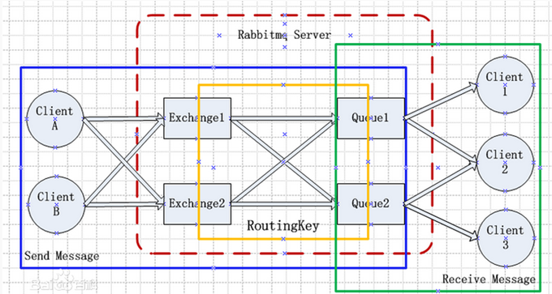
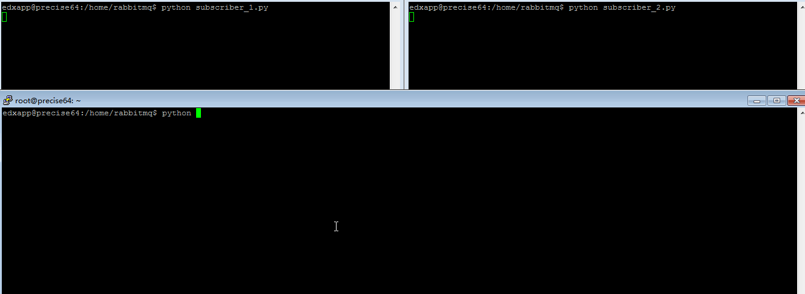

.. _RabbitMQ学习:

RabbitMQ学习
=============

``RabbitMQ`` 是一个消息代理 - 一个消息系统的媒介。它可以为你的应用提供一个通用的消息发送和接收平台，并且保证消息在传输过程中的安全。参考 `RabbitMQ中文 <http://rabbitmq.mr-ping.com/description.html>`_ 。

``RabbitMQ`` 特性:

- 可靠性
- 灵活的路由
- 集群
- 高可用的队列
- 多协议
- 广泛的客户端
- 可视化管理工具
- 插件系统

安装
-----

**ubuntu下安装**::

    sudo apt-get install rabbitmq-server   // 可以指定版本安装

**mac下安装**::

    brew install rabbitmq

**启动服务**::

    sudo service rabbitmq-server start

**RabbitMQ的工具命令集**::

    rabbitmqctl       ## RabbitMQ broker 管理工具
    rabbitmq-env      ## RabbitMQ 环境管理
    rabbitmq-plugins  ## RabbitMQ 插件管理
    rabbitmq-server   ## RabbitMQ 服务管理

**查看插件列表**::

    sudo rabbitmq-plugins list

**启用插件**::

    sudo rabbitmq-plugins enable {插件名}

**webUI管理工具**:

``RabbitMQ`` 默认自带一个webUI管理插件，通过命令 ``sudo rabbitmq-plugins enable rabbitmq_management`` 启用。默认端口55672，默认用户名：guest，密码：guest。webUI中有对rabbitmq的功能管理和任务的监控，相当强大。

.. image:: ./_static/img/rabbit/webui.png

用户角色管理
------------

RabbitMQ的用户角色分类
>>>>>>>>>>>>>>>>>>>>>>

none、management、policymaker、monitoring、administrator 5中类型角色。

**none**

不能访问management plugin

**management**

- 列出自己可以通过AMQP登入的virtual hosts  
- 查看自己的virtual hosts中的queues, exchanges 和 bindings
- 查看和关闭自己的channels 和 connections
- 查看有关自己的virtual hosts的“全局”的统计信息，包含其他用户在这些virtual hosts中的活动。

**policymaker**

包含 ``management`` 角色权限。查看，创建和删除自己的 ``virtual hosts ``所属的 ``policies`` 和 ``parameters`` 。

**monitoring**

- management可以做的任何事外加：
- 列出所有virtual hosts，包括他们不能登录的virtual hosts
- 查看其他用户的connections和channels
- 查看节点级别的数据如clustering和memory使用情况
- 查看真正的关于所有virtual hosts的全局的统计信息

**administrator**

- policymaker和monitoring可以做的任何事外加:
- 创建和删除virtual hosts
- 查看、创建和删除users
- 查看创建和删除permissions
- 关闭其他用户的connections

创建并设置用户角色
>>>>>>>>>>>>>>>>>>>

查看所有用户::

    sudo rabbitmqctl list_users

新增用户::

    sudo rabbitmqctl add_user <username> <password>
    # Example
    sudo rabbitmqctl add_user wwxiong wwxiong

赋予角色::

    sudo rabbitmqctl set_user_tags <username> <tag>
    # Example 赋予wwxiong administrator角色
    sudo rabbitmqctl set_user_tags wwxiong administrator
    > wwxiong [administrator]

创建virtual host::

    sudo rabbitmqctl add_vhost <vhostpath>
    # 创建wwxhost
    sudo rabbitmqctl add_vhost wwxhost

赋予某个用户管理virtual host::

    sudo rabbitmqctl set_permissions [-p <vhostpath>] <user> <conf> <write> <read>
    # 设置用户wwxiong对wwxhost所有资源的配置，读，写权限
    sudo rabbitmqctl set_permissions -p wwxhost wwxiong '.*' '.*' '.*'

virtual hosts中权限列表参考下图

.. image:: _static/img/rabbit/permissions.png

.. tip::

    更多配置可参考 `官网用户配置 <http://www.rabbitmq.com/access-control.html>`_ 。

AMQP协议
---------

``RabbitMQ`` 使用的是 ``AMQP`` 协议。 ``AMQP`` （高级消息队列协议）是一个网络协议。它支持符合要求的客户端应用（``application``）和消息中间件代理（``messaging middleware broker``）之间进行通信。``AMQP`` 的工作过程如下图：消息（message）被发布者（publisher）发送给交换机（exchange），交换机常常被比喻成邮局或者邮箱。然后交换机将收到的消息根据路由规则分发给绑定的队列（``queue``）。最后AMQP代理会将消息投递给订阅了此队列的消费者，或者消费者按照需求自行获取。

.. image:: _static/img/rabbit/amqp.png

协议的具体介绍可参考 `AMQP官网 <https://www.amqp.org/>`_ 。

基本概念
---------

**queue（队列）**

队列, 就是存储消息的容器。 消息是由Header和Body组成的，Header是生产者添加各种属性的集合，包括消息是否持久化，哪个queue接受，优先级等。而Body是我们需要传送的消息正文了 。queue基础属性:

- Name   #队列名称
- Durable (the queue will survive a broker restart)  # 持久性，broker重启前一直有效
- Exclusive (used by only one connection and the queue will be deleted when that connection closes)  # 唯一性，只能被一个链接使用，且链接关闭后queue销毁
- Auto-delete (queue is deleted when last consumer unsubscribes)  # 自动删除，当最后一个订阅者取消订阅后删除
- Arguments (some brokers use it to implement additional features like message TTL)  ## 可以用作其它用途，比如消息TTL（过期时间）

使用queue之前, 需要先声明. 生产者和消费者都可以申明声明. 声明的时候如果队列已经存在了, 也没啥事, 但是如果再次声明的时候, 已经存在的队列参数和当时申明的参数不一样, 是会报错的。

**channel（信道）**

``AMQP`` 协议规定只有通过 ``Channel`` 才能执行 ``AMQP`` 的命令。一个 ``Connection`` 可以包含多个 ``Channel`` 。之所以需要 ``Channel`` ，是因为TCP连接的建立和释放都是十分昂贵的，如果一个客户端每一个线程都需要与 ``Broker`` 交互，如果每一个线程都建立一个TCP连接，暂且不考虑TCP连接是否浪费，就算操作系统也无法承受每秒建立如此多的TCP连接。``RabbitMQ`` 建议客户端线程之间不要共用Channel，至少要保证共用 ``Channel`` 的线程发送消息必须是串行的，但是建议尽量共用 ``Connection``。

**exchange（交换机）**

``exchange`` 是接受生产者消息并将消息路由到消息队列的关键组件。ExchangeType和Binding决定了消息的路由规则。所以生产者想要发送消息，首先必须要声明一个exchange和该exchange对应的Binding。生产者不和queue接触, 消息全部是通过exchange转到对应的queue的. 每一个队列都和一个或者多个exchange绑定在一起. 声明一个queue的时候, 它已经和default exchange绑定在一起了。exchange的属性:

- Name # 名称
- Durability (exchanges survive broker restart)  # broker 启动后启用
- Auto-delete (exchange is deleted when all queues have finished using it)  # 所有相关queue完成后删除
- Arguments (these are broker-dependent)  # broker依赖

ExchangeType类型:

Direct Exchange：处理路由器。需要将一个队列绑定到交换机上，要求该消息与一个特定的路由键完全匹配。这是一个完整的匹配。如果一个队列绑定到该交换机上要求routing_key是”wwxiong“，只有完全匹配”wwxiong“的消息才会被转发。
Fanout Exchange：不处理routing_key，类似广播。将队列绑定到交换机上。 一个发送到交换机的消息都会被转发到与该交换机绑定的所有队列上。很像子网广播，每台子网内的主机都获得一份复制的消息。Fanout交换机转发消息是最快的。
Topic Exchange：模式匹配routing_key。队列需要绑定一个模式上。符号#匹配一个或多个词，符号*匹配不多不少一个词::

    Topic Exchange Example
    #绑定
    routing_key: animal.#
    能匹配到 animal.dog, animal.pig, animal.dog.wihte
    *绑定
    routing_key: animal.*
    能匹配到 animal.dog, animal.pig, 不能匹配 aimmal.dog.white

基本使用
----------

消息队列的使用过程大概如下：

- 客户端连接到消息队列服务器，打开一个Channel；
- 客户端声明一个Exchange，并设置相关属性；
- 客户端声明一个queue，并设置相关属性；
- 客户端使用routing key，在Exchange和queue之间建立绑定关系。
- 客户端投递消息到Exchange。

Python使用RabbitMQ
=====================

RabbitMQ使用的是AMQP协议。要使用她你就必须需要一个使用同样协议的库。几乎所有的编程语言都有可选择的库。python也是一样，可以从以下几个库中选择::

    py-amqplib
    txAMQP
    pika

本文中安装的是amqp，安装使用pip命令（``pip install amqp``）安装即可（本文不介绍RabbitMQ的原理和使用）。

**建立连接，并开启一个Channel**::

    > import amqp
    > conn = amqp.Connection(host='127.0.0.1', userid='wwxiong', password='wwxiong', virtual_host='wwxhost')
    > channel = conn.channel()  # 自动分配channel_id， 也可以指定channel_id
    > channel
    <amqp.channel.Channel object at 0x7062e50>

**创建消费者程序，包括一个exchange和一个queue**::

    # 创建一个“wwx_exchange”交换机，类型定义为“direct”，durable（持久化，重启之后会重新建立）设置为True，
    # auto_delete（最后一个消费者断开的时候不会自动删除）设置为False
    > channel.exchange_declare(exchange='wwx_exchange', type='direct', durable=True, auto_delete=False)
    # 创建一个“wwx_queue”队列，durable（持久化）设置为True，auto_delete（）设置为False， 
    # exclusive（私有化，如果设置为TRUE，只有创建这个队列的消费者程序才允许连接该队列。这种队列对于这个消费者程序是私有的。）设置为False
    > channel.queue_declare(queue='wwx_queue', durable=True, auto_delete=False, exclusive=False)
    (u'wwx_queue', 0, 0)

**绑定exchange和queue（已经有了一个可以接受消息的队列和一个可以发送消息的交换机）**::

    > channel.queue_bind(queue='wwx_queue', exchange='wwx_exchange', routing_key='wwxiong')

.. attention::

    绑定exchange和queue的时候，指定的exchange和queue的durable（持久化）必须一致。同为True或者同为False。

**消息拉取**:

channel.basic_get()方法::

    # 拉取“wwx_queue”。主动从队列当中拉出下一个消息（如果队列当中没有消息，channel.basic_get()会返回None。
    # 返回的message是amqp.Message实例
    > message = channel.basic_get('wwx_queue')
    > print message.body
    None

channel.basic_consume()::

    # 应用于发送者发送消息，消费者能立即接受到，而不需要被动使用basic_get去拉取消息。类似推送模式。
    # 回调函数
    def callabck(msg):
        print 'Received: ' + msg.body
    channel.basic_consume(queue='wwx_queue', no_ack=True, callback=callback, consumer_tag='_wwx')
    while 1:
        channel.wait()
        # 可以通过channel.basic_cancel()取消回调
        channel.basic_cancel('_wwx')

**消息发送**::

    # 定义消息
    > hello = amqp.Message('Hello world.')
    > hello.properties["delivery_mode"] = 2
    # 发送消息到“wwx_exchange”
    > channel.basic_publish(msg=hello, exchange='wwx_exchange', routing_key='wwxiong')

**关闭连接**::

    > connection.close()
    > channel.close()

.. tip::

    更多使用方法参考 `py-maqp官网 <https://github.com/celery/py-amqp>`_ 。

**订阅发布**

Publisher（发布者）:

    代码详见 `publisher.py <https://github.com/dracarysX/blog/tree/master/src/rabbitmq/publisher.py>`_ .

Subscriber_1（接受者1，routing_key # 匹配）:

    代码详见 `subscriber_1.py <https://github.com/dracarysX/blog/tree/master/src/rabbitmq/subscriber_1.py>`_ .

Subscriber_2（接受者2，routing_key * 匹配）:

    代码详见 `subscriber_2.py <https://github.com/dracarysX/blog/tree/master/src/rabbitmq/subscriber_2.py>`_ .
