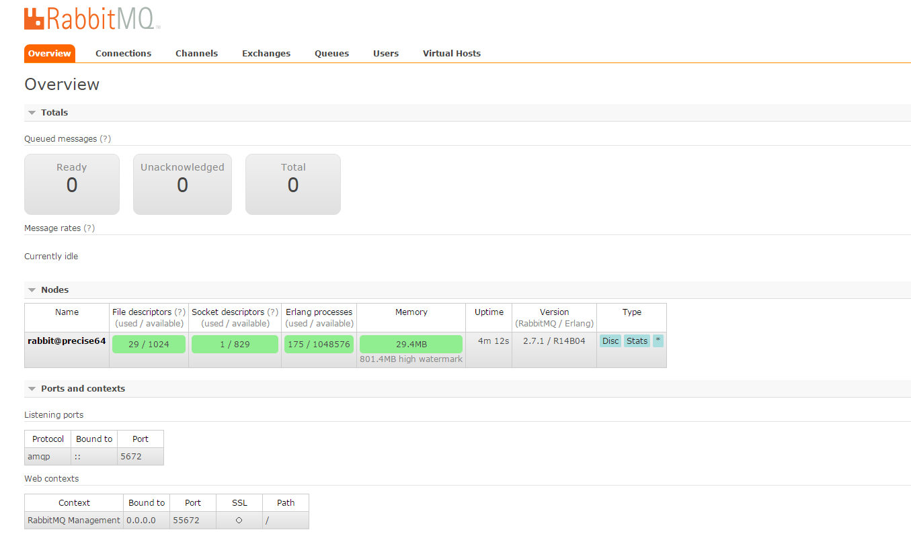
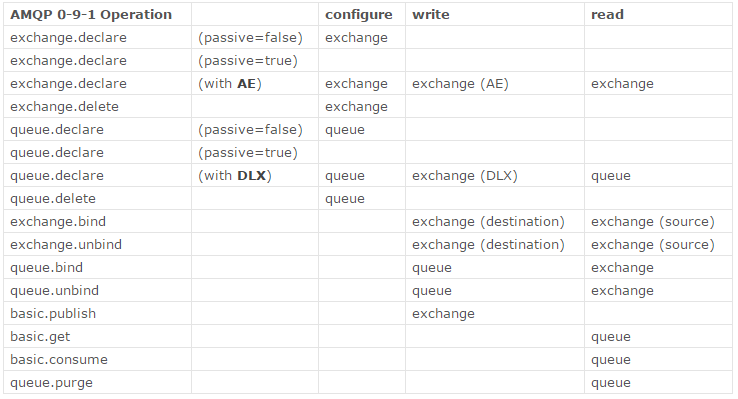

.. _RabbitMQ学习:

RabbitMQ学习
=============

``RabbitMQ`` 是一个消息代理 - 一个消息系统的媒介。它可以为你的应用提供一个通用的消息发送和接收平台，并且保证消息在传输过程中的安全。参考 `RabbitMQ中文 <http://rabbitmq.mr-ping.com/description.html>`_ 。

``RabbitMQ`` 特性:

- 可靠性
- 灵活的路由
- 集群
- 高可用的队列
- 多协议
- 广泛的客户端
- 可视化管理工具
- 插件系统

基本概念
---------

**queue**

队列, 就是存储消息的容器。 queue基础属性:

- Name   #队列名称
- Durable (the queue will survive a broker restart)  # 持久性，broker重启前一直有效
- Exclusive (used by only one connection and the queue will be deleted when that connection closes)  # 唯一性，只能被一个链接使用，且链接关闭后queue销毁
- Auto-delete (queue is deleted when last consumer unsubscribes)  # 自动删除，当最后一个订阅者取消订阅后删除
- Arguments (some brokers use it to implement additional features like message TTL)  ## 可以用作其它用途，比如消息TTL（过期时间）

使用queue之前, 需要先声明. 生产者和消费者都可以申明声明. 声明的时候如果队列已经存在了, 也没啥事, 但是如果再次声明的时候, 已经存在的队列参数和当时申明的参数不一样, 是会报错的。

**exchange**

生产者不和queue接触, 消息全部是通过exchange转到对应的queue的. 每一个队列都和一个或者多个exchange绑定在一起. 声明一个queue的时候, 它已经和default exchange绑定在一起了。exchange的属性:

- Name # 名称
- Durability (exchanges survive broker restart)  # broker 启动后启用
- Auto-delete (exchange is deleted when all queues have finished using it)  # 所有相关queue完成后删除
- Arguments (these are broker-dependent)  # broker依赖

安装
-----

**ubuntu下安装**::

    sudo apt-get install rabbitmq-server   // 可以指定版本安装

**mac下安装**::

    brew install rabbitmq

**启动服务**::

    sudo service rabbitmq-server start

**RabbitMQ的工具命令集**::

    rabbitmqctl       ## RabbitMQ broker 管理工具
    rabbitmq-env      ## RabbitMQ 环境管理
    rabbitmq-plugins  ## RabbitMQ 插件管理
    rabbitmq-server   ## RabbitMQ 服务管理

**查看插件列表**::

    sudo rabbitmq-plugins list

**启用插件**::

    sudo rabbitmq-plugins enable {插件名}

**webUI管理工具**:

``RabbitMQ`` 默认自带一个webUI管理插件，通过命令 ``sudo rabbitmq-plugins enable rabbitmq_management`` 启用。默认端口55672，默认用户名：guest，密码：guest。webUI中有对rabbitmq的功能管理和任务的监控，相当强大。

用户角色管理
------------

RabbitMQ的用户角色分类
>>>>>>>>>>>>>>>>>>>>>>

none、management、policymaker、monitoring、administrator 5中类型角色。

**none**

不能访问management plugin

**management**

- 列出自己可以通过AMQP登入的virtual hosts  
- 查看自己的virtual hosts中的queues, exchanges 和 bindings
- 查看和关闭自己的channels 和 connections
- 查看有关自己的virtual hosts的“全局”的统计信息，包含其他用户在这些virtual hosts中的活动。

**policymaker**

包含 ``management`` 角色权限。查看，创建和删除自己的 ``virtual hosts ``所属的 ``policies`` 和 ``parameters`` 。

**monitoring**

- management可以做的任何事外加：
- 列出所有virtual hosts，包括他们不能登录的virtual hosts
- 查看其他用户的connections和channels
- 查看节点级别的数据如clustering和memory使用情况
- 查看真正的关于所有virtual hosts的全局的统计信息

**administrator**

- policymaker和monitoring可以做的任何事外加:
- 创建和删除virtual hosts
- 查看、创建和删除users
- 查看创建和删除permissions
- 关闭其他用户的connections

创建并设置用户角色
>>>>>>>>>>>>>>>>>

查看所有用户::

    sudo rabbitmqctl list_users

新增用户::

    sudo rabbitmqctl add_user <username> <password>
    # Example
    sudo rabbitmqctl add_user wwxiong wwxiong

赋予角色::

    sudo rabbitmqctl set_user_tags <username> <tag>
    # Example 赋予wwxiong administrator角色
    sudo rabbitmqctl set_user_tags wwxiong administrator
    > wwxiong [administrator]

创建virtual host::

    sudo rabbitmqctl add_vhost <vhostpath>
    # 创建wwxhost
    sudo rabbitmqctl add_vhost wwxhost

赋予某个用户管理virtual host::

    sudo rabbitmqctl set_permissions [-p <vhostpath>] <user> <conf> <write> <read>
    # 设置用户wwxiong对wwxhost所有资源的配置，读，写权限
    sudo rabbitmqctl set_permissions -p wwxhost wwxiong '.*' '.*' '.*'

virtual hosts中权限列表参考下图

.. tip::

    更多配置可参考 `官网用户配置 <http://www.rabbitmq.com/access-control.html>`_ 。

AMQP协议
---------

``RabbitMQ`` 使用的是 ``AMQP`` 协议。 ``AMQP`` （高级消息队列协议）是一个网络协议。它支持符合要求的客户端应用（``application``）和消息中间件代理（``messaging middleware broker``）之间进行通信。``AMQP`` 的工作过程如下图：消息（message）被发布者（publisher）发送给交换机（exchange），交换机常常被比喻成邮局或者邮箱。然后交换机将收到的消息根据路由规则分发给绑定的队列（``queue``）。最后AMQP代理会将消息投递给订阅了此队列的消费者，或者消费者按照需求自行获取。

.. image:: _static/img/rabbit/amqp.png