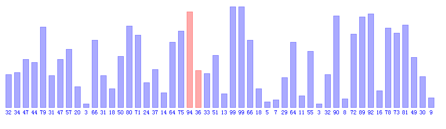

.. _Bubble Sort:

冒泡排序
========

冒泡排序（ ``Bubble Sort`` ）也是一种简单直观的排序算法。它重复地走访过要排序的数列，一次比较两个元素，如果他们的顺序错误就把他们交换过来。走访数列的工作是重复地进行直到没有再需要交换，也就是说该数列已经排序完成。这个算法的名字由来是因为越小的元素会经由交换慢慢“浮”到数列的顶端。

**步骤**

    1. 比较相邻的元素。如果第一个比第二个大，就交换他们两个。
    2. 对第0个到第n-1个数据做同样的工作。这时，最大的数就“浮”到了数组最后的位置上。
    3. 针对所有的元素重复以上的步骤，除了最后一个。
    4. 持续每次对越来越少的元素重复上面的步骤，直到没有任何一对数字需要比较。

**时间复杂度**：:math:`O(N^{2})`

.. literalinclude:: ../src/bubble.py
    :language: python
